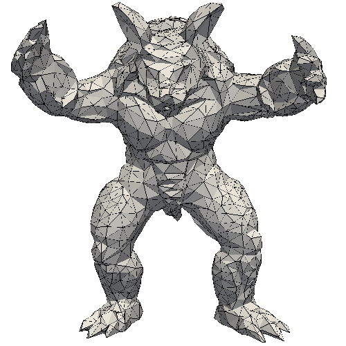
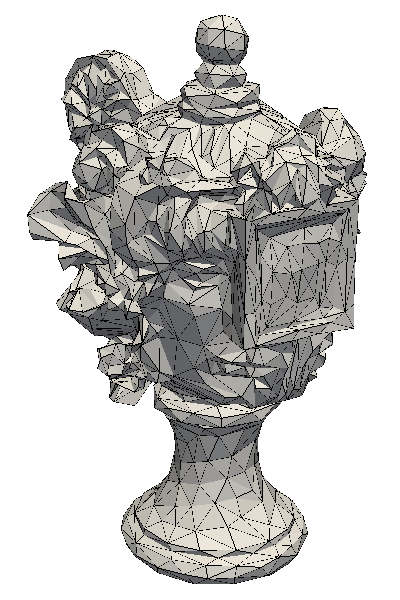
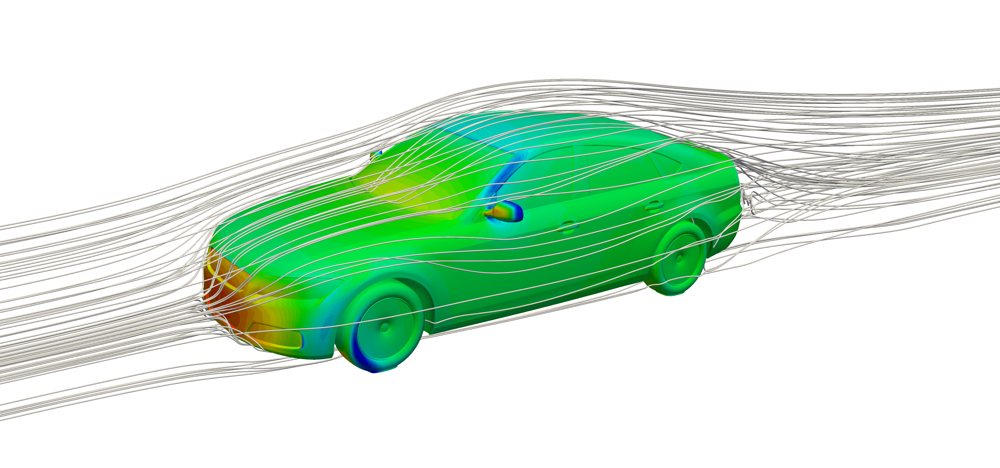
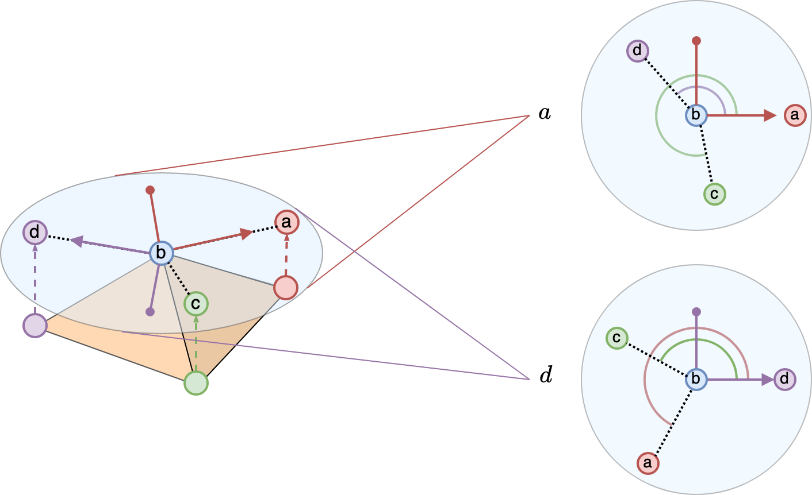
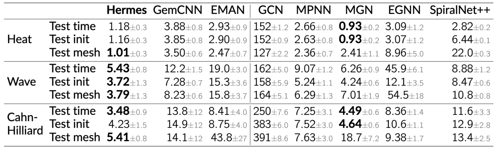
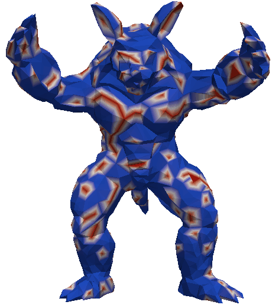

**Abstract:** Data over non-Euclidean manifolds, often discretized as surface meshes, naturally arise in computer graphics and biological and physical systems. In particular, solutions to partial differential equations (PDEs) over manifolds depend critically on the underlying geometry. While graph neural networks have been successfully applied to PDEs, they do not incorporate surface geometry and do not consider local gauge symmetries of the manifold. Alternatively, recent works on gauge equivariant convolutional and attentional architectures on meshes leverage the underlying geometry but underperform in modeling surface PDEs with complex nonlinear dynamics. To address these issues, we introduce a new gauge equivariant architecture using nonlinear message passing. Our novel architecture achieves higher performance than either convolutional or attentional networks on domains with highly complex and nonlinear dynamics. However, similar to the non-mesh case, design trade-offs favor convolutional, attentional, or message passing networks for different tasks; we investigate in which circumstances our message passing method provides the most benefit.

<style>
.centered-container {
  display: flex;
  flex-direction: row;
  align-items: center;
  justify-content: left;
  height: 5vh;
  text-align: center;
}
.button-container {
  display: flex;
  justify-content: center;
  margin-top: 0px;
  margin-bottom: 10px;
  margin-right: 10px; /* Adjust as needed */
}
.button {
  display: inline-block;
  padding: 10px 10px;
  background-color: #007bff; /* Button background color */
  color: #fff; /* Button text color */
  text-decoration: none;
  border-radius: 5px;
}

.button i {
  margin-right: 5px; /* Spacing between icon and text */
}

.column {
  float: left;
  width: 33.33%;
}
.row:after {
  content: "";
  display: table;
  clear: both;
}
.lc{
  float: left;
  width: 25%;
}
.caption {
    margin: 0;
    vertical-align: baseline;
    text-align: center;
}
img.rounded {
  object-fit: cover;
  border-radius: 50%;
  width: 120px; /* You can adjust this value depending on your layout needs */
  height: auto;
  aspect-ratio: 1/1;
  margin-left: auto;
  margin-right: auto;
  display: block;
}
.people_column {
  float: center;
  width: 340px;
}

.image-container {
  display: flex;
  justify-content: center;
  align-items: center;
}

.image-container img {
  max-width: 100%;
  height: 300px;
  width: auto;
}

figure {
  text-align: center;
}

figcaption {
  color: gray;
}

.cropped {
  width: 200px;
  height: 200px;
  overflow: hidden;
}

.gif-container {
  display: flex;
  justify-content: center;
  align-items: center;
}

.gif-container figure {
  text-align: center;
  margin: 10px;
  padding: 0;
  width: 100%;
  height: auto;
}

</style>

## Paper
Published at Advances in Neural Information Processing Systems 2023 (NeurIPS 2023)  
<div class="centered-container">
    <div class="button-container">
        <a href="https://arxiv.org/abs/2310.19589" class="button">
            <i class="fa fa-file-pdf"></i> Paper
        </a>
    </div>
    <div class="button-container">
        <a href="https://github.com/jypark0/hermes" class="button">
            <i class="fa fa-code"></i> Code
        </a>
    </div>
</div>

<div style="width:100%; display:flex">
  <div class="people_column">
    
    <p class="caption">
      <a href="https://jypark0.github.io">Jung Yeon Park</a>
    </p>
  </div>
  <div class="people_column">
    
    <p class="caption">
      <a href="https://www.ccs.neu.edu/home/lsw/">Lawson L.S. Wong</a>*
    </p>
  </div>
  <div class="people_column">
    
    <p class="caption">
      <a href="https://www.khoury.northeastern.edu/people/robin-walters/">Robin Walters</a>*
    </p>
  </div>
</div>

*Equal Advising  
Khoury College of Computer Sciences  
Northeastern University

## Idea
This work studies the problem of predicting complex dynamics over surface meshes. 

<div class="image-container">
    
    
</div> 
Meshes are a commonly used representation of non-Euclidean manifolds. 
Compared to other 3D representations such as point clouds or voxels, only meshes can represent both the topology and geometry of the manifold.

<figure>
    
    <figcaption> Image Source: <a href="https://su2code.github.io/">https://su2code.github.io</a></figcaption>
</figure>
Solving partial differential equations (PDEs), specifically over a surface, is an important task in many domains such as aerodynamics or thermodynamics.

Several approaches to learn signals over meshes often reduce it to a graph, discarding important geometric information. [Verma et al., 2018](https://arxiv.org/abs/1706.05206) and [De Haan et al., 2020](https://arxiv.org/abs/2003.05425) have shown that not incorporating the intrinsic geometry of the mesh leads to reduced performance.

<div class="image-container">
    
</div>
A key geometric aspect of a mesh is gauge symmetry. In the above figure, let's focus on vertex $$b$$ and its neighbors. After we project the neighbors onto the tangent plane at vertex $$b$$, there is ambiguity in the choice of local reference or gauge. For example, we could choose vertex $$a$$ to be the reference neighbor and we would be able to compute the angles or orientations for the other neighbors. If we choose vertex $$d$$ as the gauge, we would obtain a different set of orientations. Since the choice of local gauge was arbitrary, networks should be independent to this choice and should therefore be equivariant to local gauge transformations. In this work, we focus on gauge equivariant neural networks.


Previous works on gauge equivariant networks for meshes considered convolutional ([GemCNN](https://arxiv.org/abs/2003.05425)) and attentional ([EMAN](https://arxiv.org/abs/2205.10662)) architetures. However, in the context of modeling complex dynamics on meshes, such as solving surface PDEs, we find that they underperform.
We propose combining gauge equivariance and nonlinear message passing and name our new architecture **Hermes**.

We evaluate Hermes on several domains such as surface PDEs, cloth dynamics, object interactions, and also shape correspondence. For the surface PDEs, we consider 1) Heat, 2) Wave, and 3) Cahn-Hilliard. Heat and Wave are second-order linear PDEs, while Cahn-Hilliard is a fourth-order nonlinear PDE. Cahn-Hilliard describes phase separation in a binary fluid mixture. We also test on generalization to future timesteps (<u>test time</u>), to unseen initial conditions (<u>test init</u>), and to unseen meshes (<u>test mesh</u>).


Hermes outperforms convolutional and attentional counterparts significantly, and outperforms other baselines in most settings. In particular, it performs the best on the test mesh datasets, suggesting that it can learn the true dynamics function and overfits less to specific mesh geometries.

<div class="gif-container">
    <figure>
        
        <figcaption> GemCNN</figcaption>
    </figure>
    <figure>
        
        <figcaption> EMAN</figcaption>
    </figure>
    <figure>
        
        <figcaption> Hermes</figcaption>
    </figure>
    <figure>
        
        <figcaption> Ground Truth</figcaption>
    </figure>
</div> 

<div class="gif-container">
    <figure>
        
        <figcaption> GemCNN</figcaption>
    </figure>
    <figure>
        
        <figcaption> EMAN</figcaption>
    </figure>
    <figure>
        
        <figcaption> Hermes</figcaption>
    </figure>
    <figure>
        
        <figcaption> Ground Truth</figcaption>
    </figure>
</div>
Here are some qualitative samples generated autogressively for 50 timesteps given only the initial conditions. GemCNN diverges on Heat and EMAN diverges on Cahn-Hilliard, while Hermes gives fairly realistic rollouts.

<!--  -->
<!-- | Dataset | GemCNN | EMAN | Hermes | Ground Truth | -->
<!-- |---------|--------|------|--------|--------------| -->
<!-- | Heat (T+50)        |        |           |             |                   | -->
<!-- | Wave (T+50)        |  |  |  |   -->
<!-- | Cahn-Hilliard (T+50)        |  |  |  |  | -->

## Video
<div style="text-align:center">
  <iframe width="853" height="480" src="https://www.youtube.com/embed/2o26wIhDaro?si=NQCuh-wEoa-sbs2S" title="YouTube video player" frameborder="0" allow="accelerometer; autoplay; clipboard-write; encrypted-media; gyroscope; picture-in-picture; web-share" allowfullscreen></iframe>
</div>

## Code
<https://github.com/jypark0/hermes>

## Citation

```
@inproceedings{
  park2023modeling,
  title={Modeling Dynamics over Meshes with Gauge Equivariant Nonlinear Message Passing},
  author={Park, Jung Yeon and Wong, Lawson L.S. and Walters, Robin},
  booktitle={Advances in Neural Information Processing Systems (NeurIPS)},
  year={2023},
  url={https://arxiv.org/abs/2310.19589}
}
```


## Contact
If you have any questions, please feel free to contact [Jung Yeon Park](https://jypark0.github.io) at park[dot]jungy[at]northeastern[dot]edu.
