**Abstract:** Data over non-Euclidean manifolds, often discretized as surface meshes, naturally arise in computer graphics and biological and physical systems. In particular, solutions to partial differential equations (PDEs) over manifolds depend critically on the underlying geometry. While graph neural networks have been successfully applied to PDEs, they do not incorporate surface geometry and do not consider local gauge symmetries of the manifold. Alternatively, recent works on gauge equivariant convolutional and attentional architectures on meshes leverage the underlying geometry but underperform in modeling surface PDEs with complex nonlinear dynamics. To address these issues, we introduce a new gauge equivariant architecture using nonlinear message passing. Our novel architecture achieves higher performance than either convolutional or attentional networks on domains with highly complex and nonlinear dynamics. However, similar to the non-mesh case, design trade-offs favor convolutional, attentional, or message passing networks for different tasks; we investigate in which circumstances our message passing method provides the most benefit.

<style>
.centered-container {
  display: flex;
  flex-direction: row;
  align-items: center;
  justify-content: left;
  height: 5vh;
  text-align: center;
}
.button-container {
  display: flex;
  justify-content: center;
  margin-top: 0px;
  margin-bottom: 10px;
  margin-right: 10px; /* Adjust as needed */
}
.button {
  display: inline-block;
  padding: 10px 10px;
  background-color: #007bff; /* Button background color */
  color: #fff; /* Button text color */
  text-decoration: none;
  border-radius: 5px;
}

.button i {
  margin-right: 5px; /* Spacing between icon and text */
}

.column {
  float: left;
  width: 33.33%;
}
.row:after {
  content: "";
  display: table;
  clear: both;
}
.lc{
  float: left;
  width: 25%;
}
.caption {
    margin: 0;
    vertical-align: baseline;
    text-align: center;
}
img.rounded {
  object-fit: cover;
  border-radius: 50%;
  width: 120px; /* You can adjust this value depending on your layout needs */
  height: auto;
  aspect-ratio: 1/1;
  margin-left: auto;
  margin-right: auto;
  display: block;
}
.people_column {
  float: center;
  width: 340px;
}
</style>

## Paper
Published at Advances in Neural Information Processing Systems 2023 (NeurIPS 2023)  
<div class="centered-container">
<div class="button-container">
    <a href="https://arxiv.org/abs/2310.19589" class="button">
        <i class="fa fa-file-pdf"></i> Paper
    </a>
</div>
<div class="button-container">
    <a href="https://openreview.net/forum?id=0eXniewIvr" class="button">
        <i class="fas fa-comments"></i> OpenReview
    </a>
</div>
<!-- <div class="button-container"> -->
<!--     <a href="" class="button"> -->
<!--         <i class="fa fa-code"></i> Code -->
<!--     </a> -->
<!-- </div> -->
</div>

<div style="width:100%; display:flex">
  <div class="people_column">
    
    <p class="caption">
      <a href="https://jypark0.github.io">Jung Yeon Park</a>
    </p>
  </div>
  <div class="people_column">
    
    <p class="caption">
      <a href="https://www.ccs.neu.edu/home/lsw/">Lawson L.S. Wong</a>*
    </p>
  </div>
  <div class="people_column">
    
    <p class="caption">
      <a href="https://www.khoury.northeastern.edu/people/robin-walters/">Robin Walters</a>*
    </p>
  </div>
</div>

*Equal Advising  
Khoury College of Computer Sciences  
Northeastern University

## Idea
This work studies the problem of predicting complex dynamics over surface meshes. 
Previous approaches work on patches of the mesh by approximating them to be Euclidean. However, these approaches do not exploit the geometric properties of the mesh, leading to reduced performance.

A key geometric aspect of a mesh is a global coordinate frame or gauge may not exist and one must define local gauges at every node.
However, the choice of local gauge to define a local coordinate frame is arbitrary, and thus signals over the mesh should be unaffected by the choice of gauge.
One way to express such geometric information is to specify the local gauge symmetries and explicitly incorporate equivariance to gauge transformations.

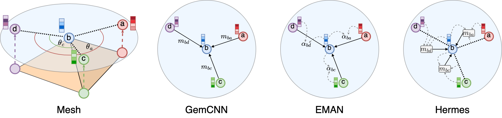

Gauge equivariant convolutional ([GemCNN](https://arxiv.org/abs/2003.05425)) and attentional ([EMAN](https://arxiv.org/abs/2205.10662)) methods have been previously proposed, but we find they are inadequate for modeling complex dynamics on meshes, such as solving surface partial differential equations (PDEs), which can be highly nonlinear.
We propose combining gauge equivariance and nonlinear message passing and name our new architecture **Hermes**.

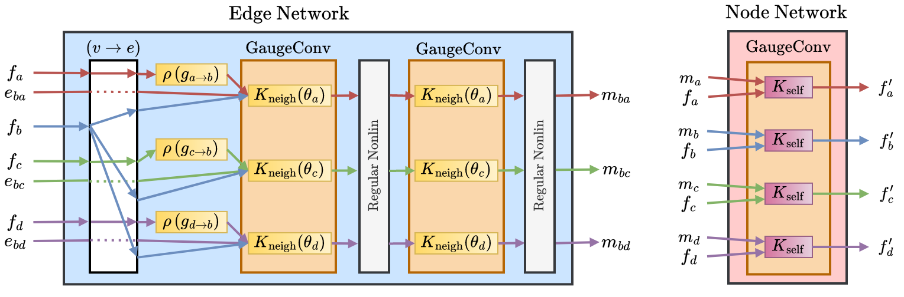

Each Hermes message passing block consists of an edge and node network that uses gauge-equivariant kernels and nonlinearities.

We evaluate Hermes primarily on PDEs on meshes: 1) Heat, 2) Wave, and 3) Cahn-Hilliard. Heat and Wave are second-order linear PDEs, while Cahn-Hilliard is a fourth-order nonlinear PDE. Cahn-Hilliard describes phase separation in a binary fluid mixture.

| Dataset | GemCNN | EMAN | Hermes | Ground Truth |
|---------|--------|------|--------|--------------|
| Heat (T+50)        | 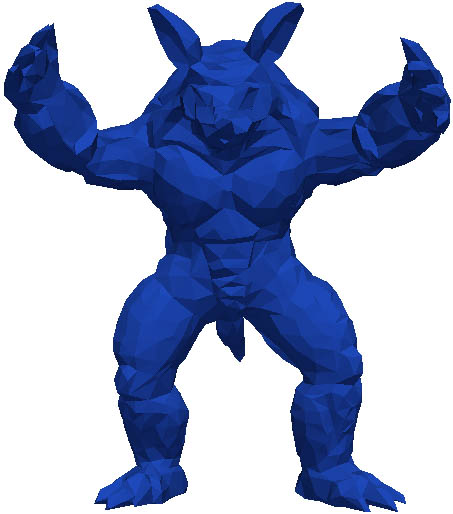       |  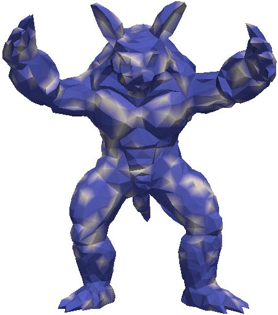         |  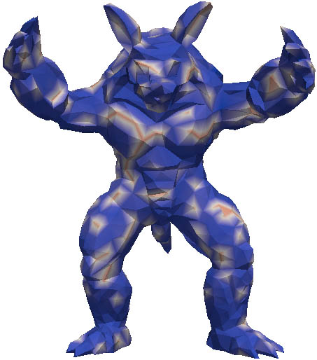           | 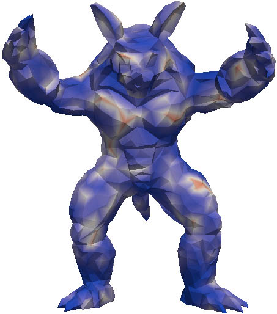                  |
| Wave (T+50)        | 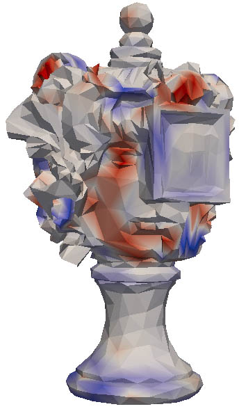 | 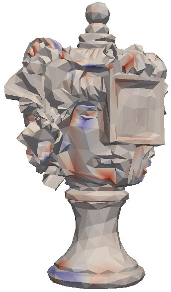 | 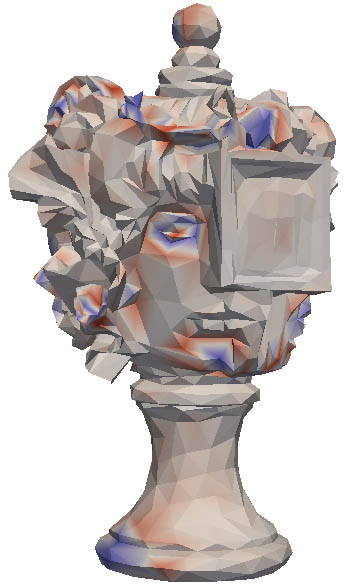 | 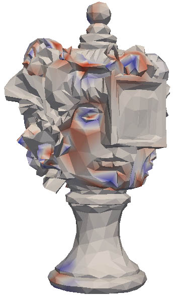 
| Cahn-Hilliard (T+50)        | 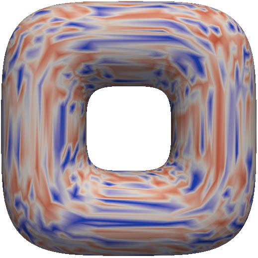 | 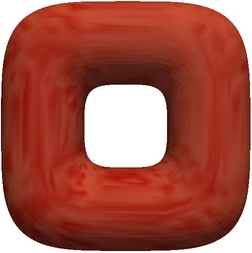 | 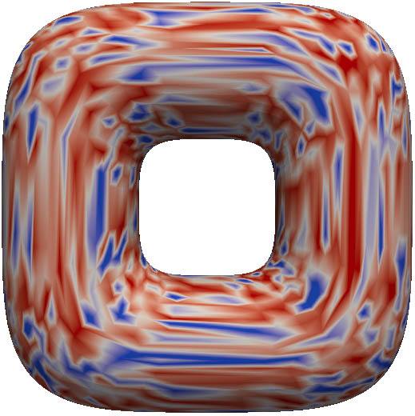 | 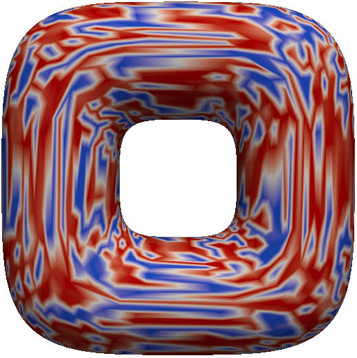 |

When we generate rollouts given only initial conditions, Hermes can produce realistic predictions and predict general spatial patterns well.

## Code
To be released soon.

## Citation

```
@inproceedings{
park2023modeling,
title={Modeling Dynamics over Meshes with Gauge Equivariant Nonlinear Message Passing},
author={Park, Jung Yeon and Wong, Lawson L.S. and Walters, Robin},
booktitle={Advances in Neural Information Processing Systems (NeurIPS)},
year={2023},
url={https://arxiv.org/abs/2310.19589}
}
```


## Contact
If you have any questions, please feel free to contact [Jung Yeon Park](https://jypark0.github.io) at park[dot]jungy[at]northeastern[dot]edu.
