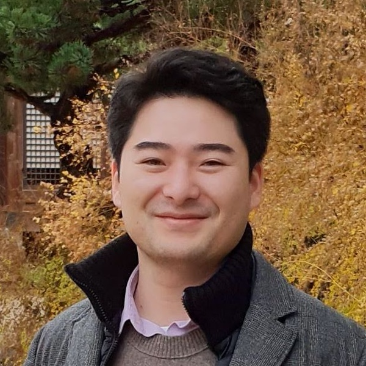

**Abstract:** Data over non-Euclidean manifolds, often discretized as surface meshes, naturally arise in computer graphics and biological and physical systems. In particular, solutions to partial differential equations (PDEs) over manifolds depend critically on the underlying geometry. While graph neural networks have been successfully applied to PDEs, they do not incorporate surface geometry and do not consider local gauge symmetries of the manifold. Alternatively, recent works on gauge equivariant convolutional and attentional architectures on meshes leverage the underlying geometry but underperform in modeling surface PDEs with complex nonlinear dynamics. To address these issues, we introduce a new gauge equivariant architecture using nonlinear message passing. Our novel architecture achieves higher performance than either convolutional or attentional networks on domains with highly complex and nonlinear dynamics. However, similar to the non-mesh case, design trade-offs favor convolutional, attentional, or message passing networks for different tasks; we investigate in which circumstances our message passing method provides the most benefit.

<style>
.column {
  float: left;
  width: 33.33%;
}
.row:after {
  content: "";
  display: table;
  clear: both;
}
.lc{
  float: left;
  width: 25%;
}
.caption {
    margin: 0;
    vertical-align: baseline;
    text-align: center;
}
img.rounded {
  object-fit: cover;
  border-radius: 50%;
  width: 120px; /* You can adjust this value depending on your layout needs */
  height: auto;
  aspect-ratio: 1/1;
  margin-left: auto;
  margin-right: auto;
  display: block;
}
.people_column {
  float: center;
  width: 340px;
}
</style>

## Paper
Published at Advances in Neural Information Processing Systems 2023 (NeurIPS 2023)  
[arXiv]()  

<div style="width:100%; display:flex">
  <div class="people_column">
    
    <p class="caption">
      <a href="https://jypark0.github.io">Jung Yeon Park</a>
    </p>
  </div>
  <div class="people_column">
    
    <p class="caption">
      <a href="https://www.ccs.neu.edu/home/lsw/">Lawson L.S. Wong</a>*
    </p>
  </div>
  <div class="people_column">
    
    <p class="caption">
      <a href="https://www.khoury.northeastern.edu/people/robin-walters/">Robin Walters</a>*
    </p>
  </div>
</div>

*Equal Advising  
Khoury College of Computer Sciences  
Northeastern University

## Idea
Idea

## Code
To be released soon.

## Citation

```
@inproceedings{
wang2023surprising,
title={The Surprising Effectiveness of Equivariant Models in Domains with Latent Symmetry},
author={Dian Wang and Jung Yeon Park and Neel Sortur and Lawson L.S. Wong and Robin Walters and Robert Platt},
booktitle={International Conference on Learning Representations},
year={2023},
url={https://openreview.net/forum?id=P4MUGRM4Acu}
}
```


## Contact
If you have any questions, please feel free to contact [Jung Yeon Park](https://jypark0.github.io) at park[dot]jungy[at]northeastern[dot]edu.
